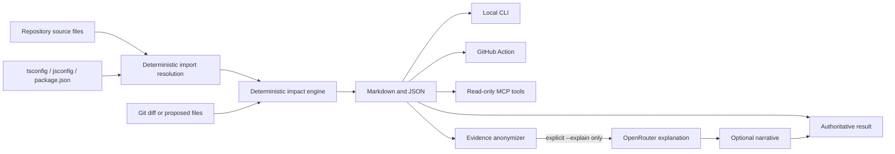

# RepoRipple architecture

RepoRipple keeps one deterministic analysis engine at the center and exposes it through several
small adapters. The optional model layer explains evidence; it never creates or changes that
evidence.

## Responsibility boundaries

| Layer | Responsibility | Network access |
| --- | --- | --- |
| Core scanner and analyzer | Build the import graph, trace reverse dependencies, suggest tests, and score deterministic risk | Never |
| CLI | Select changes and render reports | Never, unless `--explain` is explicitly present |
| GitHub Action | Run the CLI in CI and publish summaries, artifacts, and eligible PR comments | GitHub only |
| MCP server | Give coding agents typed, read-only access within an allowed workspace root | Never |
| OpenRouter adapter | Explain an anonymized evidence bundle | Explicit opt-in only |

## JavaScript and TypeScript resolution

RepoRipple resolves each JavaScript or TypeScript import against repository source files in this
order:

1. Relative paths.
2. `paths` mappings from the nearest applicable `tsconfig.json` or `jsconfig.json`, using the most
   specific matching pattern and its declared target order.
3. That configuration's `baseUrl`.
4. A uniquely named npm/Yarn workspace declared by the root `package.json`.

Workspace package resolution observes declared export boundaries and local entry points. A bare
specifier that is not one of those workspaces remains external and does not become a graph edge.
Workspace selection supports recursive globs, bounded brace alternatives and ranges, and
exclusions. Export conditions are syntax-aware: `.mts`/`.mjs` use an import profile,
`.cts`/`.cjs` use a require profile, and ambiguous TypeScript/JavaScript files inspect both.
Applicable custom conditions declared before a syntax or `default` fallback are included
conservatively, preserving browser-, platform-, and source-specific dependency edges without
assuming one deployment environment.

The resolver intentionally does not correlate repeated custom-condition names across nested
objects. That can retain extra edges that no single runtime condition set would choose, but avoids
false-negative impact reports when the deployment condition set is unknown.

RepoRipple does not inspect `node_modules`, execute a package manager, or parse
`pnpm-workspace.yaml`. Consequently, configurations whose only targets are ignored or unavailable
build artifacts can remain unresolved. Pathological workspace glob sets that exceed fixed matching
budgets fail closed with a warning: 512 effective patterns, 2,048 aggregate path components across
unique patterns, 64 KiB of raw patterns, and 256 KiB after brace expansion. Resolver metadata
changes receive configuration-risk and documentation signals, but configuration and manifest
files are not yet graph nodes, so a metadata-only edit does not enumerate all importers whose
resolution could change.

## Relationship to Graphify

RepoRipple is not an official Graphify extension and does not depend on Graphify. Graphify builds a
broad, persistent knowledge graph for repository exploration; RepoRipple is a focused, Git-native
gate for one proposed or actual change. The products overlap in dependency analysis but serve
different default workflows.

A future compatibility adapter could consume `graphify-out/graph.json` for richer language and
cross-system coverage while retaining RepoRipple's reports, policies, and CI behavior. Until that
adapter exists, describe RepoRipple as standalone—not as endorsed by or built into Graphify.

## Trust model

- Repository files are parsed, never executed.
- TypeScript, JavaScript, and workspace configuration is treated as data. RepoRipple does not load
  configuration modules, run package scripts, or invoke npm, Yarn, or another package manager.
- Alias and workspace targets must normalize inside the repository and resolve to a discovered
  source file before they can become dependency edges.
- Git is invoked with argument arrays rather than a shell; user-provided base revisions are
  resolved to commit IDs before they reach diff operations.
- Deleted and renamed source files are read from the comparison revision and overlaid in memory so
  their surviving reverse dependencies remain visible without changing the worktree.
- MCP tools reject repositories and changed paths outside the configured root.
- The GitHub workflow never runs untrusted pull-request code with a write-capable token.
- The optional explanation request contains opaque evidence IDs and generic metadata, not code or
  paths. The local process resolves cited evidence IDs back to human-readable labels.
