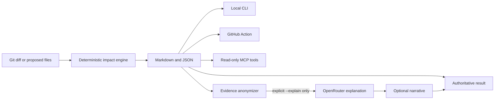

# RepoRipple architecture

RepoRipple keeps one deterministic analysis engine at the center and exposes it through several
small adapters. The optional model layer explains evidence; it never creates or changes that
evidence.

## Responsibility boundaries

| Layer | Responsibility | Network access |
| --- | --- | --- |
| Core scanner and analyzer | Build the import graph, trace reverse dependencies, suggest tests, and score deterministic risk | Never |
| CLI | Select changes and render reports | Never, unless `--explain` is explicitly present |
| GitHub Action | Run the CLI in CI and publish summaries, artifacts, and eligible PR comments | GitHub only |
| MCP server | Give coding agents typed, read-only access within an allowed workspace root | Never |
| OpenRouter adapter | Explain an anonymized evidence bundle | Explicit opt-in only |

## Relationship to Graphify

RepoRipple is not an official Graphify extension and does not depend on Graphify. Graphify builds a
broad, persistent knowledge graph for repository exploration; RepoRipple is a focused, Git-native
gate for one proposed or actual change. The products overlap in dependency analysis but serve
different default workflows.

A future compatibility adapter could consume `graphify-out/graph.json` for richer language and
cross-system coverage while retaining RepoRipple's reports, policies, and CI behavior. Until that
adapter exists, describe RepoRipple as standalone—not as endorsed by or built into Graphify.

## Trust model

- Repository files are parsed, never executed.
- Git is invoked with argument arrays rather than a shell.
- MCP tools reject repositories and changed paths outside the configured root.
- The GitHub workflow never runs untrusted pull-request code with a write-capable token.
- The optional explanation request contains opaque evidence IDs and generic metadata, not code or
  paths. The local process resolves cited evidence IDs back to human-readable labels.
